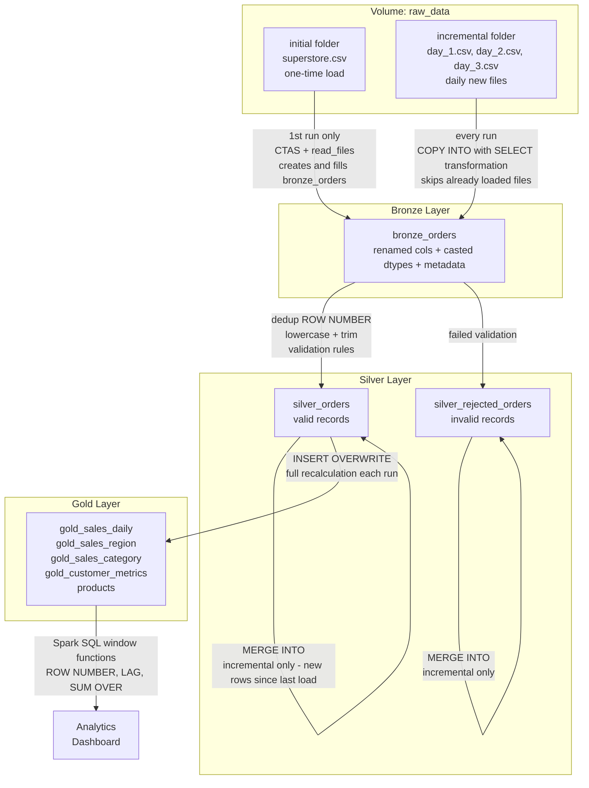

# Superstore Lakehouse Pipeline — Documentation

**Platform:** Databricks Free Edition · Unity Catalog · Delta Lake · Spark SQL / PySpark (Photon) 

**Catalog.Schema:** `ymotorna_DB.superstore_lakehouse` · **Volume:** `raw_data` (`initial/`, `incremental/`)

---

## 1. Architecture

| Layer | Table(s) | Grain |
|---|---|---|
| Bronze | `bronze_orders` | 1 row per raw CSV record |
| Silver | `silver_orders`, `silver_rejected_orders` | 1 row per valid / invalid order line, deduplicated, filtered |
| Gold | `gold_sales_daily`, `gold_sales_region`, `gold_sales_category`, `gold_customer_metrics`, `gold_products` | Aggregated, business-facing |
| Analytics | ad-hoc Spark SQL | Reporting / dashboard |

---

## 2. Data Flow

### Bronze — `bronze_orders`
- Reads CSV via `read_files()` (initial load) and `COPY INTO ... FILEFORMAT = csv` (incremental load from a separate `incremental/` folder).
- Renames raw headers to snake_case, type-casts numerics/dates with `try_cast` (invalid values become `NULL` rather than failing the load).
- Adds `ingestion_timestamp` (`current_timestamp()`) and `source_file_name` (`input_file_name()` / `_metadata.file_path`).
- No business validation at this stage — Bronze is a typed, traceable mirror of the source file.

### Silver — `silver_orders` / `silver_rejected_orders`
- A temp view `silver_cleaned` is built once and reused for both the initial load and the incremental `MERGE`.
- **Deduplication:** `ROW_NUMBER() OVER (PARTITION BY row_id ORDER BY ingestion_timestamp ASC)`, keeping the first-ingested copy of each `row_id`.
- **Standardization:** `TRIM()` on text fields, `LOWER(TRIM())` on categorical fields (`ship_mode`, `segment`, `region`, `category`, `sub_category`).
- **Validation:** a single `CASE` expression evaluates every row and assigns a `rejection_reason` (`NULL` = valid).
- Valid rows → `silver_orders`; rejected rows → `silver_rejected_orders` (with the reason kept for auditing).
- **Incremental upsert:** `MERGE INTO ... ON target.row_id = source.row_id`, filtered to `ingestion_timestamp > MAX(ingestion_timestamp)` already present in `silver_orders`, run separately for the accepted and rejected targets.

### Gold — star-style marts
Five tables, fully rebuilt each run with `INSERT OVERWRITE ... FROM silver_orders` (batch recompute, not incremental):

| Table | Columns | Spec |
|---|---|---|
| `gold_sales_daily` | `date, revenue, profit` | required (+`profit` extra) |
| `gold_sales_region` | `region, revenue` | required |
| `gold_sales_category` | `category, revenue` | required |
| `gold_customer_metrics` | `customer, revenue, orders` | required |
| `gold_products` | `product_id, product_name, category, sub_category, region, total_revenue, quantity_sold` | extra (supports Task 5 product analytics) |

### Analytics
Spark SQL against the Gold layer, demonstrating:
- **Top 5 products by revenue** — `SUM()` + `ORDER BY ... LIMIT 5`
- **Top region by revenue** — direct read of `gold_sales_region`
- **Monthly revenue trend + growth** — `LAG()` over `date_format(date,'yyyy-MM')`
- **Running revenue total** — `SUM() OVER (ORDER BY date ROWS BETWEEN UNBOUNDED PRECEDING AND CURRENT ROW)`
- **Top product per region (% of regional revenue)** — `ROW_NUMBER() OVER (PARTITION BY region ORDER BY revenue DESC)` joined to `gold_sales_region`

---

## 3. Data Quality Rules

Applied in the Silver `CASE` statement — a row is rejected if **any** condition is true:

| Rule | Required by spec? |
|---|---|
| `sales < 0` | ✅ |
| `quantity <= 0` | ✅ |
| `ship_date < order_date` | ✅ |
| `row_id`, `order_id`, `customer_id/name`, `product_id/name`, `category`, `country/city/state/region` is `NULL` | added |
| `order_date` / `ship_date` is `NULL` or unparseable | added |
| `discount < 0` | added |

Deduplication rule: keep the earliest-ingested record per `row_id` (`ROW_NUMBER` = 1).

---

## 4. Incremental Loading — Test Results (Task 3)

Two incremental batches were dropped into `raw_data/incremental/` and reprocessed (`COPY INTO` for Bronze, `MERGE INTO` for Silver):

| Stage | `bronze_orders` | `silver_orders` | `silver_rejected_orders` |
|---|---|---|---|
| Initial load | 9,994 | 9,694 | 300 |
| + Increment 1 | 10,000 (+6) | 9,694 (+0) | 306 (+6) |
| + Increment 2 | 10,005 (+5) | 9,696 (+2) | 306 (+0) |

`COPY INTO` provides exactly-once file tracking at Bronze (no `MERGE INTO` needed there); `MERGE INTO row_id` provides the upsert/dedup guarantee at Silver, per Task 3. See **Limitations** for a row-count reconciliation note on Increment 2.

---

## 5. Performance Analysis (Task 6)

**Query analyzed:** "Top product per region, % of region revenue" — joins `gold_products` (aggregated) to `gold_sales_region`.

- **Baseline:** plain Spark SQL join.
- **Optimized:** PySpark DataFrame API with `pyspark.sql.functions.broadcast()` explicitly hinted on `gold_sales_region`.
- **Result:** `baseline_df.explain()` already showed `PhotonBroadcastHashJoin` — Spark's cost-based optimizer auto-broadcasts `gold_sales_region` (4 rows) since it's well under the auto-broadcast threshold. The explicit `broadcast()` hint makes this **deterministic** rather than changing the join strategy.
- **Shuffle/Exchange:** both plans still contain `PhotonShuffleExchangeSink/Source` stages around the `GROUP BY` and window (`TopK`/`Window`) operators — those shuffles come from the aggregation and ranking, not the join, and a broadcast join cannot remove them.
- **Timing:** Baseline `1.24s` → Optimized `0.85s` (~31% faster). *Caveat:* baseline ran first in the same session, so part of the gain may reflect JIT/cache warm-up rather than the broadcast hint alone — see Limitations.

| Term | Meaning (as observed in the plan) |
|---|---|
| Shuffle | Data movement between executors, seen around `GROUP BY` / window ranking |
| Exchange | `PhotonShuffleExchangeSink/Source` — the physical operator that performs the shuffle |
| Broadcast Join | `gold_sales_region` replicated to all executors; avoids shuffling the larger `gold_products` side |
| BroadcastHashJoin | Used in **both** baseline and optimized plans (auto-selected, then hinted) |

---

## 6. Dashboard (Bonus)

Three required visuals, built on the Gold layer:

- **Revenue by Region** — West $713.5K > East $672.5K > Central $497.8K > South $389.0K
- **Revenue by Category** — Technology $836.2K > Furniture $733.1K > Office Supplies $703.5K
- **Monthly Revenue Trend** — line chart from `gold_sales_daily`; the historical Superstore data runs 2014–2017, with a later, isolated point (~2024) coming from the synthetic Task 3 incremental test files rather than the original dataset.

Total revenue reconciles across both bar charts (~$2.27M), consistent with `silver_orders` row count.

---

## 7. Assumptions

- The Superstore CSV is a single denormalized fact file — no separate dimension tables were modeled.
- `raw_data/initial/` holds the full historical load; `raw_data/incremental/` simulates the spec's `day_1.csv` / `day_2.csv` / `day_3.csv` daily drops — same semantics, different folder layout.
- Bronze applies type casting only; **all** business validation is deferred to Silver so Bronze stays a faithful, replayable copy of the source.
- Gold is small enough (≤10K orders) to fully recompute with `INSERT OVERWRITE` on every run rather than incrementally upserting.
- `gold_customer_metrics` keys on `customer_name` (no surrogate customer key was available from the source data).

## 8. Limitations

- **Gold recompute cost:** `INSERT OVERWRITE` rebuilds all Gold tables from the full `silver_orders` on every run — fine at this volume, but would not scale to a large fact table without an incremental aggregation strategy.
- **Customer key collisions:** `gold_customer_metrics` groups by `customer_name`; two distinct customers sharing a name would be merged into one row.
- **Silver merge watermark:** the `MERGE` source filter is `ingestion_timestamp > MAX(ingestion_timestamp) FROM silver_orders`. When a whole batch is rejected (as in Increment 1, where 0 rows reached `silver_orders`), that watermark doesn't advance, so the next merge re-evaluates the prior batch too. This is the likely cause of the small reconciliation gap observed after Increment 2 (5 new Bronze rows in, but only 2 net new rows landed across both Silver tables) — recommend watermarking off Bronze `ingestion_timestamp` directly, or off the max across both Silver tables.
- **No cross-layer schema/contract tests:** type mismatches surface only as `NULL` (via `try_cast`) and are caught implicitly by the Silver validation `CASE`, not by an explicit schema check.
- **Performance benchmark scope:** Task 6 timings (1.24s vs 0.85s) are from a single run on a small dataset with serverless Free Edition compute and no concurrent load — useful to illustrate the plan difference, not a production-scale benchmark.

  ## 📎 References

- [Claude.ai](https://claude.ai/share/31bed5cf-4c88-404b-bd9e-4d768ef1865f)
